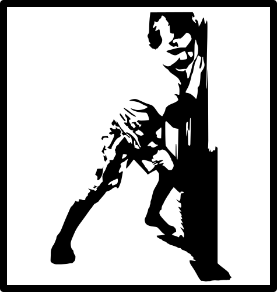

  

# Unity Doorstop

Doorstop is a tool to execute managed assemblies inside Unity as early as possible.

## Features

* **Runs first**: Doorstop runs its own code before Unity has an ability to do so.
* **Configurable**: A very basic configuration file allows to specify your own assembly to execute
* **Multiplatform**: Supports Windows, Linux, macOS

## WIP

This is a rewrite of the original Unity Doorstop. The goal of the rewrite is to clean up the code base and merge Unix version into the main build.

Current progress:

* [x] Restructure to allow multiple platform support
* [x] Port Windows support
* [x] Port mono support
* [x] Update Il2Cpp to use CoreCLR runtime 
* [ ] Port Unix support
* [ ] Add Unix build scripts
* [ ] Test that ports actually work

## Building

Doorstop uses [xmake](https://xmake.io/) to build the project. In order to build, run `build.bat` or `build.ps1`.